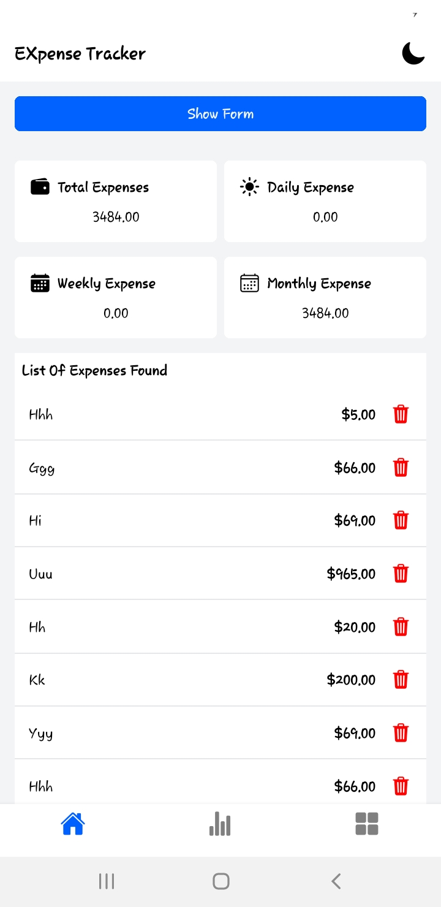
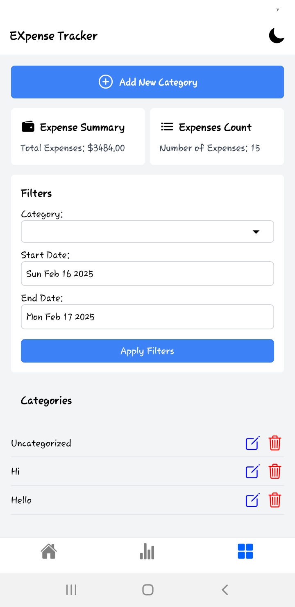
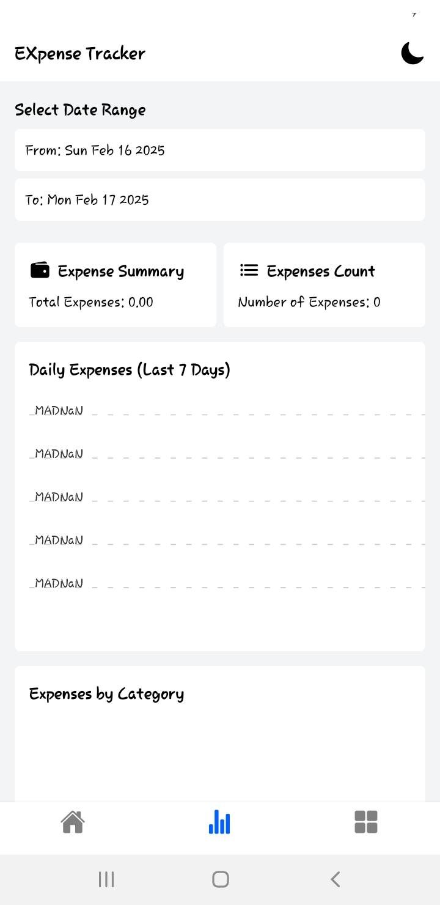
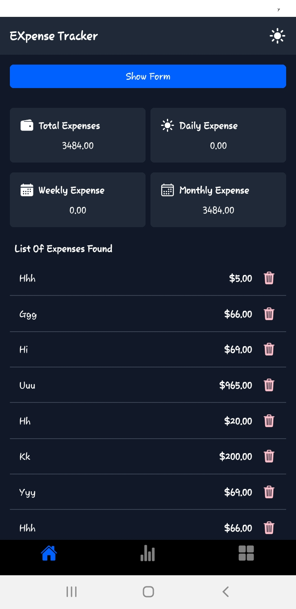
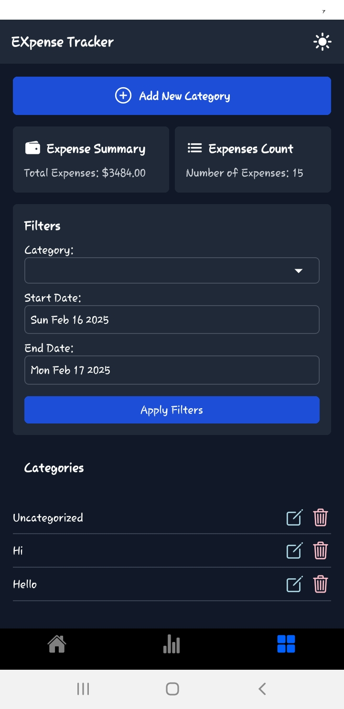
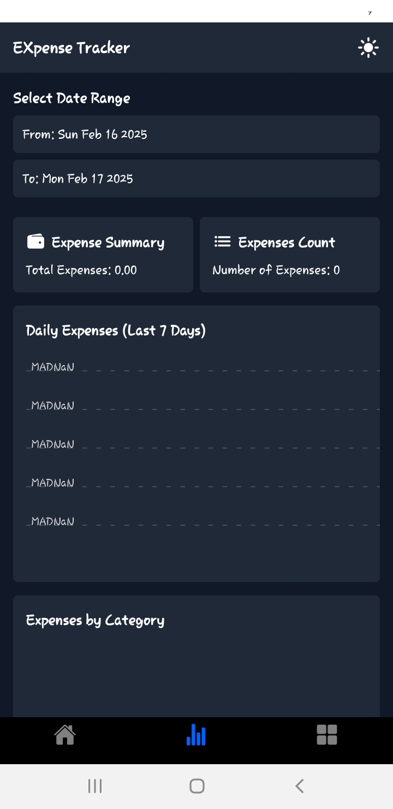

# Expense Tracker App

## Introduction

Welcome to the **Expense Tracker App**, a React Native application designed to help users track their daily expenses efficiently. This app allows users to log expenses, categorize spending, and generate reports for better financial management.

## Features

- Add and manage daily expenses
- Categorize expenses
- Generate financial reports
- Sync data across devices
- User authentication
- Dark mode support

## Screenshots

| Home Screen                           | Add Categories                                 | Expense List                                  |
| ------------------------------------- | ---------------------------------------------- | --------------------------------------------- |
|  |  |  |
|       |         |        |

## Installation

To set up the project locally, follow these steps:

1. Clone the repository:
   ```sh
   git clone https://github.com/SfAtRhl/EXpense-Tracker.git
   cd EXpense-Tracker
   ```
2. Install dependencies:
   ```sh
   npm install
   ```
3. Start the development server:
   ```sh
   npx expo start
   ```

## Building the Android App

### Generating Android App Bundle (.aab)

To generate the Android App Bundle file (.aab), run:

```sh
npx react-native build-android --mode=release
```

The output will be placed in the Android folder:

```
/android/app/build/outputs/bundle/release/app-release.aab
```

### Generating APK

To generate the APK file, run these commands:

```sh
./gradlew clean # Cleans the build folder
./gradlew assembleRelease # Generates the APK
```

The output will be placed in the Android folder:

```
/android/app/build/outputs/apk/release/app-release.apk
```

## Expo Build Process

To generate the Android folder, run:

```sh
npx expo prebuild
```

Navigate inside the `android` folder and run:

```sh
./gradlew assembleRelease # Creates .apk
./gradlew bundleRelease # Creates .aab
```

To build and run the app without caching issues:

```sh
npx expo run:android --no-build-cache
npx expo prebuild --clean
```

Using **EAS Build**:

```sh
eas build -p android --profile preview --clear-cache
```

## Contributing

Contributions are welcome! Please follow these steps:

1. Fork the repository.
2. Create a new branch.
3. Make your changes.
4. Submit a pull request.

## License

This project is licensed under the MIT License. See the LICENSE file for more details.

## Contact

For any inquiries, feel free to reach out:

- GitHub: [GitHub Profile](https://github.com/SfAtRhl)
